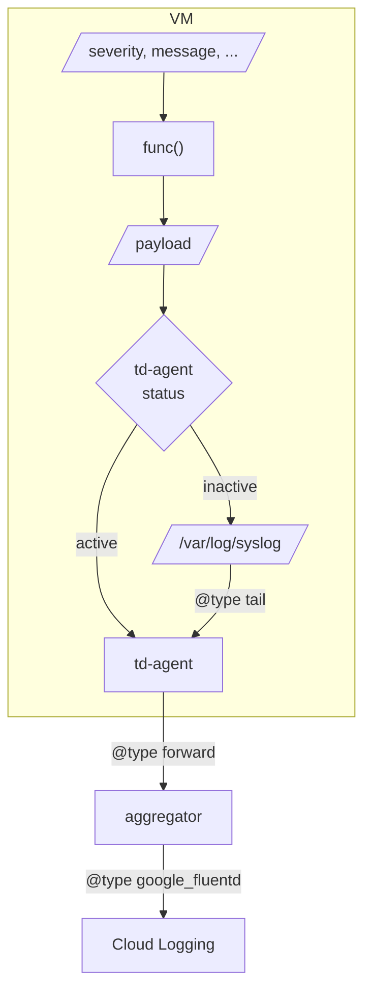

# bash_json_logger
## 
When writing shell execution logs to [Cloud Logging](https://cloud.google.com/logging), it is easy to use [gcloud logging write](https://cloud.google.com/sdk/gcloud/reference/logging/write).  
However, in my environment, I needed to write logs to Cloud Logging via the logging agent.

I created a function for me that generates a [json payload](https://cloud.google.com/logging/docs/structured-logging) to send to the logging agent.

